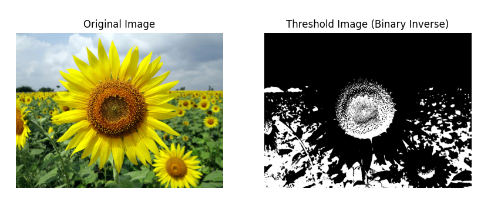

# THRESHOLDING
## Aim
To segment the image using global thresholding, adaptive thresholding and Otsu's thresholding using python and OpenCV.

## Software Required
1. Anaconda - Python 3.7
2. OpenCV

## Algorithm

**STEP 1:** **Import Necessary Libraries**  
   - Import `cv2` for image processing, `numpy` for numerical operations, and `matplotlib.pyplot` for displaying images.

**STEP 2:** **Load the Image**  
   - Use `cv2.imread()` to read the color image (e.g., "flower.jpg") and store it in a variable (e.g., `image_color`).

**STEP 3:** **Convert the Image to Grayscale**  
   - Convert the color image to grayscale using `cv2.cvtColor(image_color, cv2.COLOR_BGR2GRAY)` and store it in a variable (e.g., `image_gray`).

**STEP 4:** **Apply Global Thresholding**  
   - Use various global thresholding techniques on the grayscale image:
     - **Binary Threshold:** `cv2.threshold(image_gray, 86, 255, cv2.THRESH_BINARY)`
     - **Binary Inverse Threshold:** `cv2.threshold(image_gray, 86, 255, cv2.THRESH_BINARY_INV)`
     - **To Zero Threshold:** `cv2.threshold(image_gray, 86, 255, cv2.THRESH_TOZERO)`
     - **To Zero Inverse Threshold:** `cv2.threshold(image_gray, 86, 255, cv2.THRESH_TOZERO_INV)`
     - **Truncate Threshold:** `cv2.threshold(image_gray, 100, 255, cv2.THRESH_TRUNC)`

**STEP 5:** **Apply Otsu's Method for Automatic Thresholding**  
   - Use Otsu's method to automatically determine the optimal global threshold with:
     - `cv2.threshold(image_gray, 0, 255, cv2.THRESH_BINARY + cv2.THRESH_OTSU)`

**STEP 6:** **Apply Adaptive Thresholding**  
   - Use adaptive thresholding techniques on the grayscale image:
     - **Adaptive Mean Threshold:** `cv2.adaptiveThreshold(image_gray, 255, cv2.ADAPTIVE_THRESH_MEAN_C, cv2.THRESH_BINARY, 11, 2)`
     - **Adaptive Gaussian Threshold:** `cv2.adaptiveThreshold(image_gray, 255, cv2.ADAPTIVE_THRESH_GAUSSIAN_C, cv2.THRESH_BINARY, 11, 2)`

**STEP 7:** **Prepare for Visualization**  
   - Create a list of titles for the images corresponding to each thresholding method.
   - Create a list of processed images from each thresholding technique applied.

**STEP 8:** **Display the Results**  
   - Use a loop to iterate through the list of titles and corresponding images:
     - For each image, create a subplot to display the original image alongside the thresholded image.
     - Use `plt.imshow()` to show the images, and `plt.axis("off")` to turn off the axes for better visualization.

## Program
```md
Name    : Sam Israel D
Reg. No : 212222230128
```
```python
# Load the necessary packages
import cv2
import numpy as np
import matplotlib.pyplot as plt

# Read the image using imread
image_color = cv2.imread("color.jpg")

# Convert the image to grayscale
image_gray = cv2.cvtColor(image_color, cv2.COLOR_BGR2GRAY)

# Use Global thresholding to segment the image
ret, thresh_dipt1 = cv2.threshold(image_gray, 86, 255, cv2.THRESH_BINARY)
ret, thresh_dipt2 = cv2.threshold(image_gray, 86, 255, cv2.THRESH_BINARY_INV)
ret, thresh_dipt3 = cv2.threshold(image_gray, 86, 255, cv2.THRESH_TOZERO)
ret, thresh_dipt4 = cv2.threshold(image_gray, 86, 255, cv2.THRESH_TOZERO_INV)
ret, thresh_dipt5 = cv2.threshold(image_gray, 100, 255, cv2.THRESH_TRUNC)

# Use Otsu's method to segment the image
ret, thresh_dipt6 = cv2.threshold(image_gray, 0, 255, cv2.THRESH_BINARY + cv2.THRESH_OTSU)

# Use Adaptive thresholding to segment the image
thresh_dipt7 = cv2.adaptiveThreshold(image_gray, 255, cv2.ADAPTIVE_THRESH_MEAN_C, cv2.THRESH_BINARY, 11, 2)
thresh_dipt8 = cv2.adaptiveThreshold(image_gray, 255, cv2.ADAPTIVE_THRESH_GAUSSIAN_C, cv2.THRESH_BINARY, 11, 2)

# Display the results
titles = [
    "Gray Image",
    "Threshold Image (Binary)",
    "Threshold Image (Binary Inverse)",
    "Threshold Image (To Zero)",
    "Threshold Image (To Zero-Inverse)",
    "Threshold Image (Truncate)",
    "Otsu",
    "Adaptive Threshold (Mean)",
    "Adaptive Threshold (Gaussian)"
]

images = [
    image_gray,
    thresh_dipt1,
    thresh_dipt2,
    thresh_dipt3,
    thresh_dipt4,
    thresh_dipt5,
    thresh_dipt6,
    thresh_dipt7,
    thresh_dipt8
]

# Displaying images
for i in range(len(titles)):
    plt.figure(figsize=(10, 10))
    plt.subplot(1, 2, 1)
    plt.title("Original Image")
    plt.imshow(cv2.cvtColor(image_color, cv2.COLOR_BGR2RGB))
    plt.axis("off")

    plt.subplot(1, 2, 2)
    plt.title(titles[i])
    plt.imshow(cv2.cvtColor(images[i], cv2.COLOR_GRAY2RGB))  # Convert to RGB for display
    plt.axis("off")
    plt.show()

```
## Output

### Original Image


### Global Thresholding




### Adaptive Thresholding


### Optimum Global Thesholding using Otsu's Method


## Result
Thus the images are segmented using global thresholding, adaptive thresholding and optimum global thresholding using python and OpenCV.
